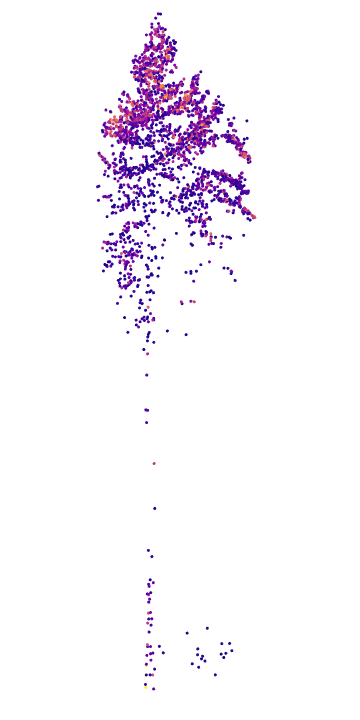

# Aerial Laser Scan (ALS)

## Über die Daten

### Datenverfügbarkeit

Für Niedersachsen werden die Daten vom Landesamt für Geoinformation und Landesvermessung Niedersachsen (LGLN) bereitgestellt. 

#### Räumlich
Aus den ALS-Daten abgeleitete Produkte wie ein Oberflächen- und Geländemodell liegen für ganz Niedersachsen und auch einen Teil der anderen Trägerländer vor. Die Punktwolke als LAS/LAZ Dateien liegt der NW-FVA aktuell für den niedersächsischen Bereich des Harzes vor. 

#### Zeitlich
Das Attribut `Stand` gibt das Datum der Metadatengenerierung an. Das Datum der Befliegung ist unter dem Attribut `Ersterfassung` in den Metadaten gelistet.   

**Aktuellste Aufnahme**
Die ALS-Daten für Niedersachsen kommen aus den Jahren 2013 bis 2020. In den Jahren wurden jeweils einzelene Teilgebiete beflogen, so dass die Daten innerhalb bestimmter zusammenhängender Gebiete aus demselben Jahr stammen aber die Datenaktualität sich zwischen den Gebieten unterscheidet. 

Hier ist eine Übersicht welches Gebiet in welchem Jahr beflogen wurde. Die aktuelle Version lässt sich [hier](https://www.lgnapp.niedersachsen.de/info_pdf/dgm1_dom1.pdf) abrufen.

**Wiederholungsaufnahmen**
Bisher wurden keine flächendeckenden Wiederholungs-Befliegungen in regelmäßigen Abständen durchgeführt. Jetzt wird allerdings angefangen Gebiete welche zuletzt vor 8-10 Jahren erfasst wurden erneut zu befliegen. In kleinen Teilbereichen ist dies bereits 2020 geschehen.

### Parameter

#### XYZ
Die Lagekoordinaten der Punkte im Raum werden als XYZ Koordinaten erfasst, relativ zu einem definierten Bezugs-Koordinatensystem. Laut dem LGLN hat die Laserscan-Punktwolke eine Punktdichte von >= 4 Punkten/m² (Last- / Only-Return), eine Lagegenauigkeit von <= 0,30 m und eine Höhengenauigkeit von <= 0,15 m. 

#### gpstime
Aufgenommen wird auch die Zeit der Messung, diese ist angegeben in der GPS-time. Zusammen mit dem Aufnahmedatum kann die Aufnahmezeit daraus errechnet werden.

#### Intensity
Die Intensität ist eine Maßeinheit, welche die Reflexionsstärke des Laserpulses für jeden Punkt beschreibt. Sie basiert teilweise auf dem Reflexionsgrad des vom Laserpuls getroffenen Objekts. Intensität ist relativ und nicht quantifizierbar. 

#### NumberOfReturns
Anzahl der für einen Laserimpuls reflektierten Teilimpulse über einem bestimmten Grenzwert. Dies geschieht wenn der Laserimpuls auf einem Teil der Fläche zurückgeworfen wird während der Rest auf anderer Höhe reflektiert wird.

#### ReturnNumber
Nummerierung der reflektierten Teilimpulse. Für einige Auswertungen werden beispielsweise nur die ersten (Oberhöhe) oder letzten (Gelände) Impulse ausgewertet.

#### Classification
Die Daten liegen als klassifizierte Punktwolke mit den Klassen Bodenpunkte (2), Gewässerpunkte(8,11), Unterbodenpunkte (z. B. Ein-/Auffahrten, Kellerschüsse und Schwimmbecken)(12), Nicht-Bodenpunkte (z. B. Gebäude, Vegetation und temporäre Aufschüttungen)(13) und sonstige Punkte (DGM- noch DOM-irrelevante Punkte wie z. B. Stromleitungen, Verkehrsmittel, Container und Vögel) vor (15). Daneben gibt es noch Ausreißer (Fehlreflexionen, Rauschen)(7) sowie Überlappungspunkte (20).

## Abgeleitete Informationen

### Digitales Geländemodell
Das Digitale Geländemodell (**DGM**) beschreibt die Erdoberfläche ohne Vegetation und Bebauung. Für die Berechnung werden primär die "last returns" herangezogen. Die englische Bezeichnungen ist digital terrain model (DTM). Die Bezeichnungen digitales Höhenmodell (DHM) bzw. digital elevation model (DEM) wird teilweise synonym für das DGM benutzt, bezeichnet manchmal aber auch als Oberbegriff sowohl DGM als auch  DOM.

### Digitales Oberflächenmodell
Das Digitale Oberflächenmodell (**DOM**) repräsentiert die Erdoberfläche samt allen darauf befindlichen Objekten (Bebauung, Vegetation, Gewässer,...). Für die Berechnung aus Laserscanning-Daten werden primär die "first returns" herangezogen. Mittels image-matching kann auch aus überlappenden Orthofotos ein bildbasiertes Oberflächenmodell generiert werden. 

### Normalisiertes Digitales Oberflächenmodell
Als Differenz zwischen einem DGM und einem DOM bildet ein normalisiertes Digitales Oberflächenmodell (**nDOM**) die relative Höhe von Objekten über dem Gelände ab. Bezogen auf die Vegetationsoberhöhe wird es teilweise auch als canopy height model (CHM) bezeichnet.

### Waldspezifische Informationen

#### Baumhöhen
Basierend auf der normalisierten Punktwolke können Baumhöhen abgeleitet werden. Verschiedene Verfahren wurden dazu entwickelt, bei denen meistens vereinfacht gesagt in einem definierten Radius das lokale Maximum gefiltert wird um einzelne Baumspitzen zu detektieren.

#### Baumsegmentierung
Ausgehend von den Baumpositionen, welche bereits bei der Baumhöhenableitung detektiert wurden, kann die Punktwolke (oder Teile davon) mit verschiedenen Algorithmen einzelnen Baumindividuen zugeordnet (segmentiert) werden.

#### Einzelbaumparameter
 

Aus der segmentierten Punktwolke lassen sich Parameter auf Einzelbaumebene berechnen. So ließe sich beispielsweise die Baumkronenbreite, die Kronenansatzhöhe oder das Kronenvolumen schätzen. Auch abstraktere Werte z.B. zur vertikalen Punktverteilung lassen sich ableiten. 
 

## Quellen

- [Laserscan Punktwolke Formatbeschreibung](https://www.lgln.niedersachsen.de/download/129180/Produkt-_und_Formatbeschreibung_Laserscan-Punktwolke.pdf)
- [3D Messdaten Standard](https://www.adv-online.de/AdV-Produkte/Standards-und-Produktblaetter/Standards-der-Geotopographie/binarywriterservlet?imgUid=80320dc8-5a29-8971-d478-d9d43b36c4c2&uBasVariant=11111111-1111-1111-1111-111111111111)

